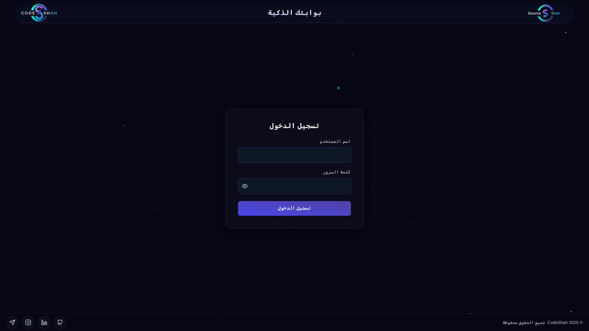
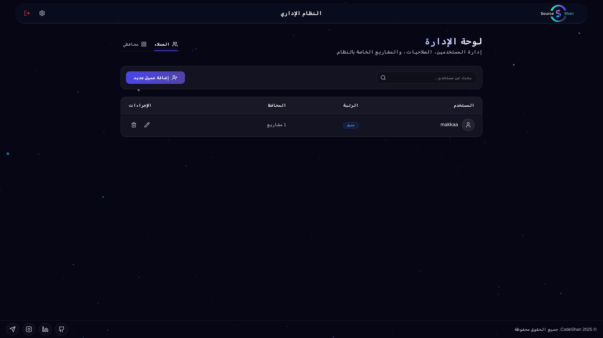
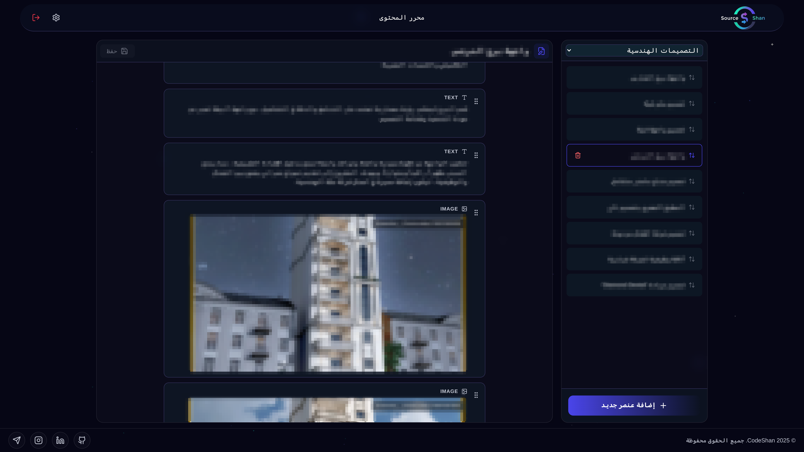
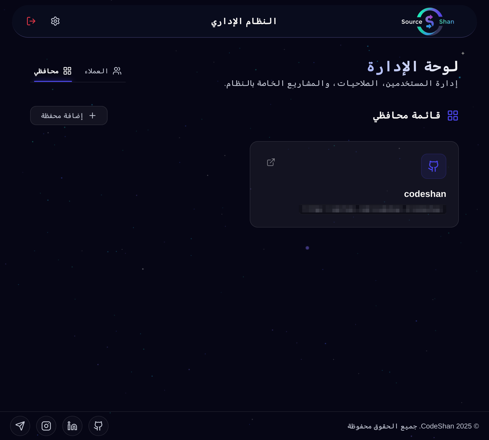

<div align="center" dir="rtl">

<!-- Header with SourceShan colors -->


<br/>

### 🔐 نظام إدارة محفظة الأعمال متعدد العملاء (Multi-Tenant)

> **الحماية عند الحافة (Edge) قبل حتى أن يستيقظ الخادم**

<p>
  <a href="https://sourceshan.vercel.app">
    
  </a>
  <a href="#-التوثيق">
    
  </a>
  <a href="README.md">
    
  </a>
</p>

<br/>


<br/>

[]()
[]()
[]()
[]()

</div>

<div align="center">

</div>

<div dir="rtl">

<br/>

## 📊 إحصائيات سريعة

<div align="center">

<table>
  <tr>
    <td align="center">
      <h3>🛡️</h3>
      <b>طبقات الأمان</b><br/>
      <sub>5 مستويات</sub>
    </td>
    <td align="center">
      <h3>👨‍💻</h3>
      <b>الدور</b><br/>
      <sub>Solo Full-Stack</sub>
    </td>
    <td align="center">
      <h3>💻</h3>
      <b>أسطر الكود</b><br/>
      <sub>~6,500 TypeScript</sub>
    </td>
    <td align="center">
      <h3>🧩</h3>
      <b>المكونات</b><br/>
      <sub>53 ملف</sub>
    </td>
    <td align="center">
      <h3>⚡</h3>
      <b>عمر التوكن (TTL)</b><br/>
      <sub>15 دقيقة (Access)</sub>
    </td>
  </tr>
</table>

</div>

<br/>

<div align="center">

</div>

<br/>

## 🛠️ المكدس التقني (Technology Stack)

<div align="center">

**🌟 Frontend**
<p>


</p>

**🔐 الأمان والمصادقة (Security & Auth)**
<p>


</p>

**💾 الخلفية والتخزين (Backend & Storage)**
<p>


</p>

**☁️ البنية التحتية (Infrastructure)**
<p>


</p>

</div>

<br/>

<div align="center">

</div>

<br/>

## 🎯 القصة (The Story)

### 🌍 السياق
كنت أقوم ببناء محافظ الأعمال (portfolios) للعملاء يدوياً. كل تعديل—إضافة مشروع، تغيير صورة—كان يجب أن يمر عبري. العميل يرسل طلباً، أنا أعدل الكود، ثم أنشر. لم يكن هذا قابلاً للتوسع.

ولدت فكرة SourceShan من سؤال بسيط: *"هل يجب أن أعود إليك في كل مرة أريد فيها إضافة مشروع؟"*

أشعل هذا السؤال فكرة لمنصة كاملة—لوحة تحكم تتيح لكل عميل إدارة محفظته بشكل مستقل.

### ⚡ التحدي
بناء نظام متعدد العملاء (multi-tenant) مع **عزل كامل للبيانات** مع الحفاظ على تجربة مستخدم سلسة:

| التحدي | الوصف |
|:---------:|-------------|
| 🔐 **الأمان على نطاق واسع** | عملاء متعددون، ثغرة واحدة قد تعرض الجميع للخطر |
| ⚡ **قيود Serverless** | معمارية Lambda تهدد باستنفاد اتصالات قاعدة البيانات |
| 🔄 **عمليات ذرية (Atomic)** | تحديثات المحفظة تتضمن ملفات متعددة (JSON + صور) |
| 📐 **تطور المخطط (Schema)** | الحقول الجديدة لا ينبغي أن تتطلب تغييرات في الكود |

### 🚀 الحل

<table>
<tr>
<td width="33%" valign="top">

#### 🛡️ قلعة الحافة (Edge Fortress)
التحقق من JWT على مستوى CDN باستخدام JOSE. الرموز غير الصالحة تُرفض قبل استيقاظ Node.js. تكلفة حوسبة صفرية للطلبات السيئة.

</td>
<td width="33%" valign="top">

#### 🔄 نظام التوكن المزدوج
وصول لمدة 15 دقيقة + توكن تحديث (Refresh) لمدة 7 أيام. التدوير الصامت يحافظ على الجلسات دون انقطاع. المستخدمون لا يواجهون أي توقف.

</td>
<td width="33%" valign="top">

#### 📐 واجهة مبنية على المخطط
يتم إنشاء النماذج ديناميكياً من مخططات JSON. تظهر الحقول الجديدة تلقائياً—صفر كود إضافي.

</td>
</tr>
</table>

<br/>

<div align="center">

</div>

<br/>

## 🏗️ معمارية النظام

```
┌─────────────────────────────────────────────────────────────────┐
│                     🛡️ EDGE LAYER (Vercel CDN)                  │
│  ┌───────────────────────────────────────────────────────────┐  │
│  │           middleware.ts (JOSE JWT Verification)            │  │
│  │  • Token validation before Node.js                        │  │
│  │  • Automatic token refresh                                │  │
│  │  • RBAC enforcement (admin/client)                        │  │
│  └───────────────────────────────────────────────────────────┘  │
│                                                                  │
└─────────────────────────────────────────────────────────────────┘
                                 │
                                 ▼
┌─────────────────────────────────────────────────────────────────┐
│                    💻 APPLICATION LAYER                          │
│  ┌─────────────┐  ┌─────────────┐  ┌─────────────────────────┐  │
│  │ API Routes  │  │   React     │  │    Service Layer        │  │
│  │ /api/auth/* │  │ Components  │  │ • lib/github.ts         │  │
│  │ /api/admin/*│  │ • MainEditor│  │ • lib/auth.ts           │  │
│  │ /api/portfolio│ │ • Admin    │  │ • lib/mongodb.ts        │  │
│  └──────┬──────┘  └─────────────┘  └──────────┬──────────────┘  │
└─────────┼─────────────────────────────────────┼─────────────────┘
          │                                     │
          ▼                                     ▼
┌──────────────────────┐              ┌──────────────────────┐
│      MongoDB         │              │    GitHub Repos      │
│  • Users collection  │              │  • Portfolio JSON    │
│  • Auth data         │              │  • Images/assets     │
│  • Portfolio refs    │              │  • Version history   │
└──────────────────────┘              └──────────────────────┘
```

<br/>

<div align="center">

</div>

<br/>

## ✨ الميزات الأساسية

<table>
<tr>
<td width="50%" valign="top">

### 🛡️ مصادقة قلعة الحافة (Edge Fortress Auth)
التحقق من JWT عند حافة Vercel باستخدام JOSE. الرموز غير الصالحة ترفض عند الـ CDN—صفر استيقاظ للخادم.

**النقاط التقنية البارزة:**
- `middleware.ts` مخصص في Edge Runtime
- JOSE لـ JWT متوافق مع Edge
- تحديث تلقائي للتوكن خلال دورة حياة الطلب
- RBAC بأدوار المسؤول/العميل

**الأثر:** رفض فوري وبدون تكلفة للطلبات غير الصالحة

</td>
<td width="50%" valign="top">

### 📐 محرك نماذج مبني على المخطط
نماذج ديناميكية مولدة من مخططات JSON تلقائياً.

**النقاط التقنية البارزة:**
- 7+ عارضين متخصصين للحقول
- Framer Motion لإعادة الترتيب بالسحب والإفلات
- دعم ثنائي اللغة (عربي/إنجليزي) مع RTL
- PendingMediaContext للتحميلات المرحلية

**الأثر:** تغييرات المخطط = تحديثات واجهة تلقائية

</td>
</tr>
<tr>
<td width="50%" valign="top">

### 🔄 نظام التزام GitHub الدفعي (Batch Commit)
عمليات ذرية متعددة الملفات باستخدام Git Trees API.

**النقاط التقنية البارزة:**
- التزام واحد لعمليات ملفات متعددة
- إعادة بناء شجرة كاملة للحذف
- التخزين المؤقت لمعرف التثبيت (Installation ID)
- دعم المحتوى النصي والثنائي

**الأثر:** سلامة البيانات مضمونة، وتاريخ أنظف

</td>
<td width="50%" valign="top">

### 🔗 تجميع الاتصالات العالمي (Global Connection Pooling)
اتصالات قاعدة بيانات آمنة لبيئة Serverless.

**النقاط التقنية البارزة:**
- تحسين TypeScript global augmentation
- التخزين المؤقت للوعود (Promise caching) يمنع سباق البيانات
- النجاة من بدايات Lambda الباردة و HMR
- إعادة الاتصال التلقائي عند الفشل

**الأثر:** لا أخطاء "Too Many Connections"

</td>
</tr>
</table>

<br/>

### 🔐 المصادقة ثنائية التوكن (Dual-Token Auth)

| التوكن | المدة | التخزين | الحماية |
|:-----:|:--------:|:-------:|:----------:|
| 🔑 **Access Token** | 15 دقيقة | HttpOnly cookie | منع XSS |
| 🔄 **Refresh Token** | 7 أيام | HttpOnly cookie | منع CSRF |

- التدوير الصامت يحافظ على الجلسة دون انقطاع
- Edge middleware يتعامل مع التحديث بشفافية

<br/>

<div align="center">

</div>

<br/>

## 💡 التحديات والحلول

<table>
<tr>
<td align="center" width="25%">🌐</td>
<td><b>قيود Edge Runtime</b></td>
</tr>
<tr>
<td colspan="2">

**المشكلة:** مكتبة `jsonwebtoken` لا تعمل في Edge Runtime.

**الحل:** استخدام `jose` للتحقق في Edge، و `jsonwebtoken` للتوقيع في Node.js. التحقق أكثر تكراراً، لذا يتعامل Edge مع المسار الساخن.

**النتيجة:** الأفضل من العالمين—سرعة Edge ومكتبة توقيع ناضجة.

</td>
</tr>
<tr>
<td align="center" width="25%">🔄</td>
<td><b>ذرية GitHub API</b></td>
</tr>
<tr>
<td colspan="2">

**المشكلة:** واجهة برمجة تطبيقات المحتويات تنشئ N التزامات لـ N ملفات—ليست ذرية.

**الحل:** تنفيذ `batchCommit()` باستخدام Git Trees API. كل التغييرات في التزام واحد، أو لا شيء.

**النتيجة:** ذرية حقيقية، تاريخ أنظف، استدعاءات API أقل.

</td>
</tr>
<tr>
<td align="center" width="25%">💾</td>
<td><b>اتصالات قاعدة البيانات Serverless</b></td>
</tr>
<tr>
<td colspan="2">

**المشكلة:** تقوم Vercel Lambdas بإنشاء اتصالات جديدة لكل طلب، مما يستنفد الحدود.

**الحل:** نمط Global Singleton لتخزين الاتصالات عبر الاستدعاءات.

**النتيجة:** اتصالات مستقرة، لا أخطاء استنفاد.

</td>
</tr>
</table>

<br/>

<div align="center">

</div>

<br/>

## 📊 النتائج والأثر

### ⚡ الإنجازات التقنية

<div align="center">

| المقياس | القيمة |
|:------:|:-----:|
| 📝 **أسطر الكود** | ~6,500 TypeScript |
| 🔷 **تغطية الأنواع** | 100% Strict Mode |
| 🧩 **المكونات** | 53 ملف معياري |
| 🛡️ **طبقات الأمان** | 5 (Edge → API → RBAC → Bcrypt → HttpOnly) |

</div>

### ✅ تحسينات الأمان

- ✅ **صفر حوسبة خادم** للرموز غير الصالحة (رفض Edge)
- ✅ **نافذة هجوم 15 دقيقة** (رموز وصول قصيرة العمر)
- ✅ **ملفات تعريف ارتباط HttpOnly** (حماية XSS)
- ✅ **عزل كامل للبيانات** (معمارية متعددة العملاء)
- ✅ **تجزئة Bcrypt** (10 جولات، معيار الصناعة)

### 📈 الأثر التجاري

- 📈 **استقلالية العميل** — لا مزيد من التعديلات اليدوية لتحديثات المحتوى
- 📈 **قابلية التوسع** — تعدد العملاء يدعم عملاء غير محدودين
- 📈 **سلامة البيانات** — الالتزامات الذرية تمنع الفساد

<br/>

<div align="center">

</div>

<br/>

## 📚 التوثيق

<div align="center">

| الوثيقة | الوصف |
|:--------:|:------------|
| [📋 نظرة عامة](docs/ar/01-overview.md) | سياق المشروع والرؤية |
| [❓ بيان المشكلة](docs/ar/02-problem-statement.md) | التحديات التي تم حلها |
| [🏗️ معمارية الحل](docs/ar/03-solution-architecture.md) | الغوص العميق في تصميم النظام |
| [✨ الميزات الأساسية](docs/ar/04-key-features.md) | تفصيل الميزات |
| [🔧 القرارات التقنية](docs/ar/05-technical-decisions.md) | سجلات بأسلوب ADR |
| [💡 التحديات والحلول](docs/ar/06-challenges-solutions.md) | حل المشكلات الهندسية |
| [⚡ الأداء](docs/ar/07-performance.md) | استراتيجيات التحسين |
| [🧪 الاختبار والجودة](docs/ar/08-testing-quality.md) | نهج ضمان الجودة |
| [🚀 النشر](docs/ar/09-deployment.md) | البنية التحتية و CI/CD |
| [📊 النتائج والأثر](docs/ar/10-results-impact.md) | المقاييس والنتائج |

</div>

<br/>

<div align="center">

</div>

<br/>

## 🖼️ لقطات الشاشة (Screenshots)

<div align="center">

| 🔐 تسجيل الدخول | 🎛️ لوحة تحكم المسؤول |
|:--------:|:------------------:|
|  |  |

| 📝 المحرر | 👥 إدارة المستخدمين |
|:---------:|:------------------:|
|  |  |

</div>

<br/>

<div align="center">

</div>

<br/>

## ⚠️ ملاحظة المستودع

<div align="center">

> هذا **مستودع دراسة حالة** يعرض النهج التقني والدروس المستفادة.
> كود المشروع الفعلي مملوك وغير متاح للجمهور.

</div>

<table align="center">
<tr>
<td align="center" valign="top" width="50%">

### ✅ ما هو مضمن
- 📐 مخططات معمارية
- 📝 سجلات قرارات تقنية
- ⚡ عينات كود (مفاهيمية)
- 📊 تحليل أمني

</td>
<td align="center" valign="top" width="50%">

### ❌ ما هو غير مضمن
- 🔒 الكود المصدري الفعلي
- 📊 بيانات العملاء أو بيانات الاعتماد
- 🔐 منطق العمل التجاري المملوك

</td>
</tr>
</table>

<br/>

<div align="center">

</div>

<br/>

<div align="center">

## 🌐 استكشف المنصة الحية

<a href="https://sourceshan.vercel.app">
  
</a>

<br/><br/>

---

**هل تريد مناقشة هذا المشروع؟**

<p>
<a href="https://codeshan.vercel.app">
  
</a>
<a href="https://github.com/codeshan-1">
  
</a>
<a href="https://www.linkedin.com/in/codeshan/">
  
</a>
</p>

---

<br/>

تم البناء بـ 💜 بواسطة **CodeShan**

⭐ ضع نجمة لهذا المستودع إذا وجدته مفيداً!

<br/>


</div>

</div>
