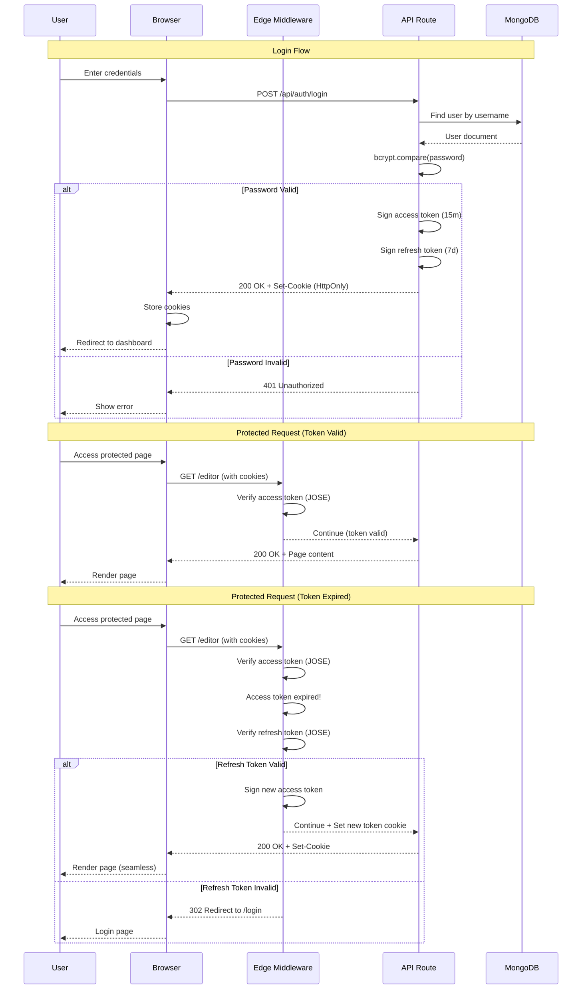
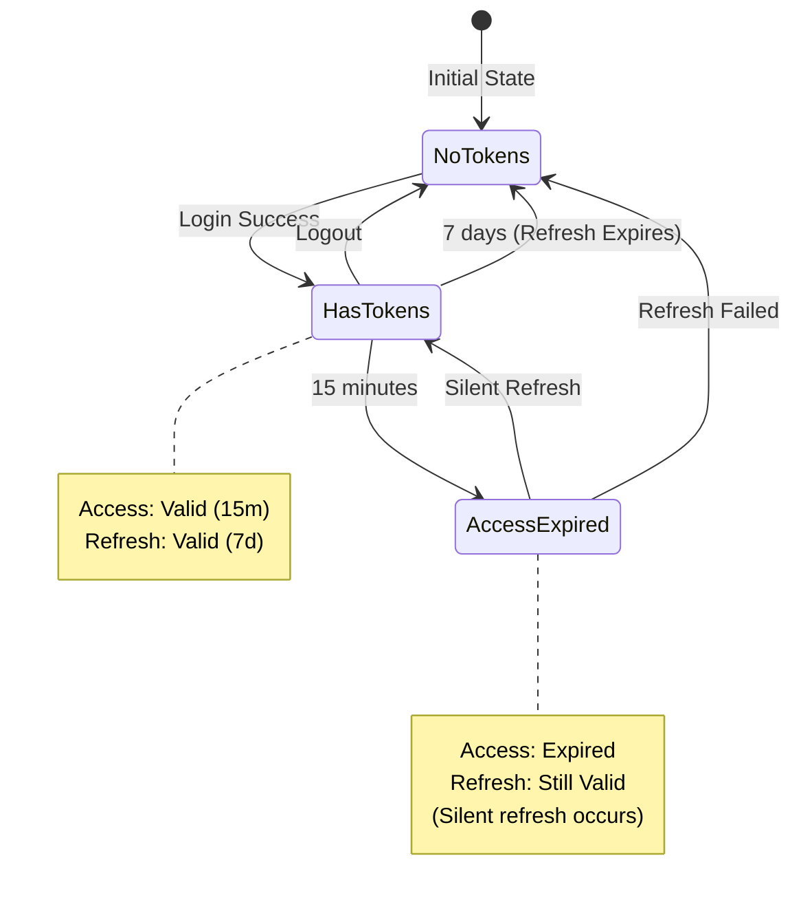

# Authentication Flow Diagram

## Complete Auth Flow with Token Refresh

## Token Lifecycle

## Cookie Configuration

| Cookie | HttpOnly | Secure | SameSite | Max-Age | Purpose |
|--------|----------|--------|----------|---------|---------|
| accessToken | ✅ | ✅ (prod) | None | 15 min | Short-lived auth |
| refreshToken | ✅ | ✅ (prod) | None | 7 days | Session continuity |

*Related: [Feature: Dual-Token Rotation](../docs/04-key-features.md#feature-2-dual-token-rotation-system)*
