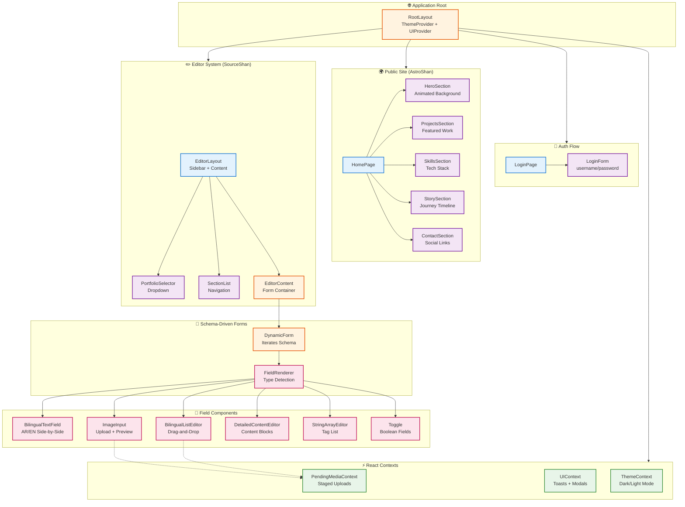
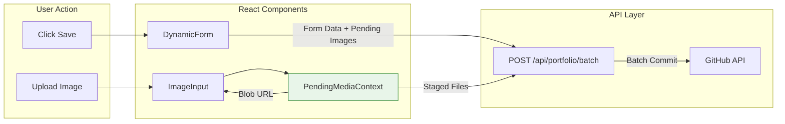

# Component Hierarchy

## SourceShan React Component Tree

## Component Categories

### 📄 Page Components
Top-level route components that define page structure.

| Component | Route | Description |
|-----------|-------|-------------|
| `LoginPage` | `/login` | Authentication entry point |
| `HomePage` | `/` | Public portfolio landing page |
| `EditorLayout` | `/editor/*` | Protected CMS interface |

### 🎨 Section Components
Major content sections of the public site.

| Component | Purpose | Key Features |
|-----------|---------|--------------|
| `HeroSection` | Introduction | Canvas stars, LED effects |
| `ProjectsSection` | Featured work | Modal previews, galleries |
| `SkillsSection` | Tech stack | Animated skill bars |
| `StorySection` | Journey timeline | Bilingual content |
| `ContactSection` | Social links | Footer with links |

### 📝 Form Components
Schema-driven form system components.

| Component | Detects | Renders |
|-----------|---------|---------|
| `FieldRenderer` | Field type from schema | Appropriate field component |
| `BilingualTextField` | `{ar, en}` object | Side-by-side RTL/LTR inputs |
| `ImageInput` | `format: "image"` | Upload button + preview |
| `BilingualListEditor` | `array + x-format` | Draggable AR/EN pairs |
| `DetailedContentEditor` | `x-format: "detailed-content"` | Content blocks |
| `StringArrayEditor` | `array + items: string` | Tag input |
| `Toggle` | `type: boolean` | On/off switch |

### ⚡ Context Providers
Cross-cutting concerns managed via React Context.

| Context | Scope | Provides |
|---------|-------|----------|
| `PendingMediaContext` | Editor | Image staging, deletion tracking |
| `UIContext` | Global | `showToast()`, `showConfirm()` |
| `ThemeContext` | Global | Dark/light mode toggle |

## Data Flow Between Components

*Related: [Schema-Driven Forms](../code-samples/frontend/schema-driven-forms.md) | [Pending Media Context](../code-samples/frontend/pending-media-context.md)*
