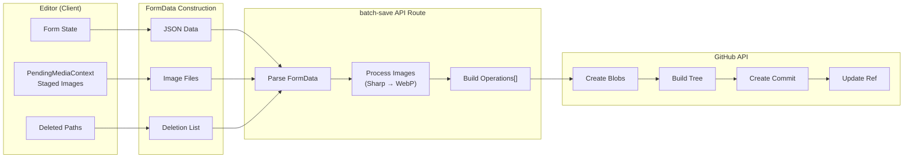
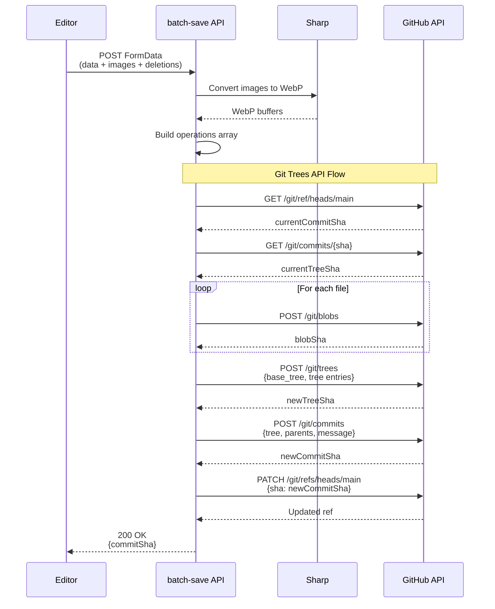
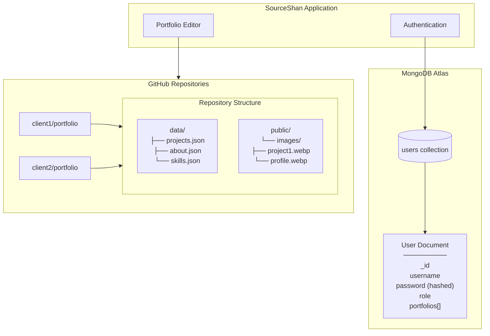

# Data Flow Diagram

## Portfolio Save Operation

## Detailed Batch Commit Flow

## Data Persistence Split

## Key Points

| Data Type | Stored In | Reason |
|-----------|-----------|--------|
| User credentials | MongoDB | Sensitive, needs encryption |
| User portfolios list | MongoDB | Links users to repos |
| Portfolio content | GitHub | Version control, auto-deploy |
| Images | GitHub | Part of content, served via CDN |

*Related: [Solution Architecture](../docs/03-solution-architecture.md)*
