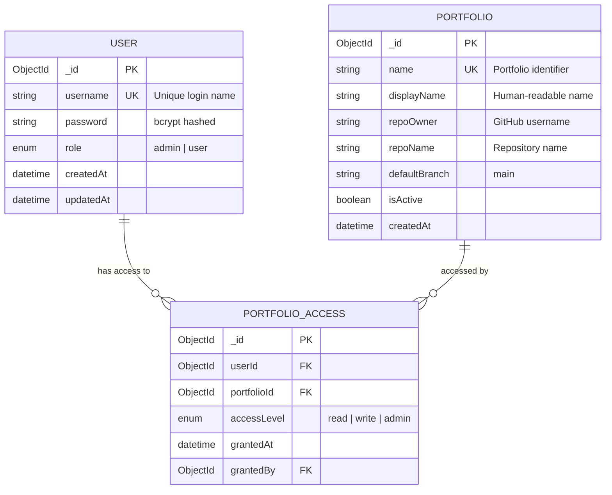
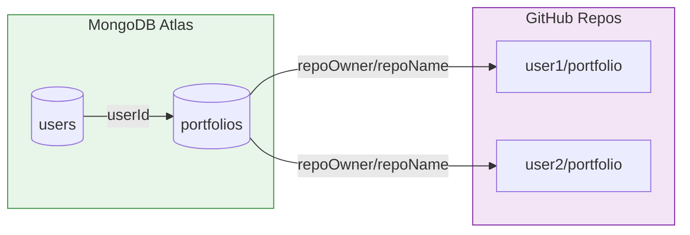

# Database Schema (Simplified)

⚠️ **Note:** This is a simplified representation. Actual schema includes additional fields, indexes, and security measures.

## Data Storage Strategy

SourceShan uses a **hybrid data storage** approach:

| Storage | Type | Contains |
|---------|------|----------|
| **MongoDB** | Document DB | User credentials, portfolio assignments |
| **GitHub** | Git Repository | Portfolio content, images, schemas |


<div align="center">

</div>


## MongoDB Collections



### Collection Details

#### `users` Collection

```javascript
// Example document (simplified)
{
  "_id": ObjectId("..."),
  "username": "shan",
  "password": "$2b$10$...",  // bcrypt hash
  "role": "admin",
  "createdAt": ISODate("2024-01-01T00:00:00Z"),
  "updatedAt": ISODate("2024-06-15T12:30:00Z")
}
```

**Indexes:**
- `username`: Unique index for fast lookup

#### `portfolios` Collection

```javascript
// Example document (simplified)
{
  "_id": ObjectId("..."),
  "name": "codeshan",
  "displayName": "CodeShan Developer Portfolio",
  "repoOwner": "username",
  "repoName": "codeshan-portfolio",
  "defaultBranch": "main",
  "isActive": true,
  "createdAt": ISODate("2024-01-01T00:00:00Z")
}
```

**Indexes:**
- `name`: Unique index for portfolio lookup


<div align="center">

</div>


## GitHub Repository Structure

Each portfolio is stored in a GitHub repository:

```
portfolio-repo/
├── data/
│   ├── projects.json       # Project entries
│   ├── about.json          # Bio and story
│   ├── skills.json         # Technology stack
│   ├── contact.json        # Contact information
│   └── sections.json       # Section configuration
├── public/
│   └── images/
│       ├── projects/       # Project images
│       ├── story/          # Journey timeline images
│       └── hero/           # Hero section assets
└── schemas/
    ├── projects.schema.json
    ├── about.schema.json
    └── ...
```

### Example JSON Document

```json
// data/projects.json (simplified)
{
  "items": [
    {
      "id": "sourceshan",
      "title": {
        "ar": "سورسشان",
        "en": "SourceShan"
      },
      "description": {
        "ar": "نظام إدارة المحتوى...",
        "en": "A portfolio CMS..."
      },
      "image": "public/images/projects/sourceshan.webp",
      "tags": ["Next.js", "TypeScript", "MongoDB"],
      "featured": true,
      "year": 2024
    }
  ],
  "lastUpdated": "2024-06-15T12:30:00Z"
}
```


<div align="center">

</div>


## Schema-Driven Validation

Each JSON file has a corresponding JSON Schema:

```json
// schemas/projects.schema.json (simplified)
{
  "$schema": "http://json-schema.org/draft-07/schema#",
  "type": "object",
  "properties": {
    "items": {
      "type": "array",
      "items": {
        "type": "object",
        "properties": {
          "id": { "type": "string" },
          "title": {
            "type": "object",
            "properties": {
              "ar": { "type": "string" },
              "en": { "type": "string" }
            }
          },
          "image": {
            "type": "string",
            "format": "image",
            "x-upload-path": "public/images/projects"
          }
        },
        "required": ["id", "title"]
      }
    }
  }
}
```


<div align="center">

</div>


## Data Relationships



### Key Relationships

1. **User → Portfolio (via portfolios collection)**
   - One user can access multiple portfolios
   - Access levels: `read`, `write`, `admin`

2. **Portfolio → GitHub Repository (via repoOwner/repoName)**
   - Each portfolio points to one GitHub repository
   - Repository contains content and schemas


<div align="center">

</div>


## Indexing Strategy

| Collection | Index | Type | Purpose |
|------------|-------|------|---------|
| `users` | `username` | Unique | Fast login lookup |
| `portfolios` | `name` | Unique | Portfolio identification |
| `portfolios` | `isActive` | Regular | Filter active portfolios |


<div align="center">

</div>


## Security Measures

1. **Password Hashing**: bcrypt with 10 salt rounds
2. **No PII in GitHub**: Only content, no user data
3. **Separate Secrets**: MongoDB and GitHub have separate credentials
4. **Role-Based Access**: Admin vs User capabilities


<div align="center">

</div>


*Related: [Hybrid Data Storage Pattern](../code-samples/patterns/hybrid-data-storage.md) | [Serverless Connection Pool](../code-samples/backend/serverless-connection-pool.md)*
