# Deployment Pipeline

## Vercel Deployment Flow

SourceShan uses **Vercel** for automated deployments with git-based workflow.


<div align="center">

</div>


## Pipeline Stages Detail

### 1. Local Development

```bash
# Start development server
npm run dev

# Run linting
npm run lint

# Type checking
npm run type-check
```

### 2. Git Workflow


### 3. Vercel Build Process


### 4. Deployment Types

| Branch | Deploy Type | URL | Visibility |
|--------|-------------|-----|------------|
| `main` | Production | `sourceshan.vercel.app` | Public |
| PR branches | Preview | `pr-xxx.vercel.app` | Team link |
| Feature branches | Preview | `feature-xxx.vercel.app` | Team link |


<div align="center">

</div>


## Environment Configuration

### Environment Variables


### Variable Management

| Variable | Development | Preview | Production |
|----------|-------------|---------|------------|
| `MONGODB_URI` | Local/Dev Atlas | Dev Atlas | Prod Atlas |
| `JWT_SECRET` | Dev secret | Dev secret | Prod secret |
| `GITHUB_APP_ID` | Test App | Test App | Prod App |


<div align="center">

</div>


## Rollback Strategy

```mermaid
flowchart LR
    ISSUE["🚨 Issue Detected"]
    IDENTIFY["Identify Bad Deploy"]
    ROLLBACK["Instant Rollback<br/>Promote Previous"]
    VERIFY["Verify Recovery"]
    HOTFIX["Optional: Hotfix<br/>New Deploy"]
    
    ISSUE --> IDENTIFY
    IDENTIFY --> ROLLBACK
    ROLLBACK --> VERIFY
    VERIFY --> |"Issue Persists"| IDENTIFY
    VERIFY --> |"Resolved"| HOTFIX
```



### Rollback Methods

1. **Instant Rollback (Vercel Dashboard)**
   - Click "Promote to Production" on previous deployment
   - Takes effect in ~10 seconds
   - Zero downtime

2. **Git Revert**
   ```bash
   git revert HEAD
   git push origin main
   # Triggers new deploy with reverted code
   ```


<div align="center">

</div>


## Monitoring & Alerts


<div align="center">

</div>


## Build Performance

| Metric | Value | Notes |
|--------|-------|-------|
| Install time | ~15s | With cache |
| Build time | ~45s | Full rebuild |
| Deploy time | ~10s | Edge propagation |
| **Total** | **~70s** | Main branch to live |

### Optimization Techniques

1. **Dependency Caching**: `node_modules` cached between builds
2. **Build Caching**: `.next/cache` persisted
3. **Incremental Builds**: Only changed pages rebuilt
4. **Edge Functions**: <20ms cold start


<div align="center">

</div>


## CI/CD Checklist

- [x] Automatic deploys on push
- [x] Preview deployments for PRs
- [x] Environment variable management
- [x] Instant rollback capability
- [x] Build caching enabled
- [ ] Automated tests pre-deploy (TODO)
- [ ] Lighthouse CI integration (TODO)
- [ ] Slack/Discord notifications (TODO)


<div align="center">

</div>


*Related: [Solution Architecture](../docs/03-solution-architecture.md) | [Deployment Docs](../docs/09-deployment.md)*
