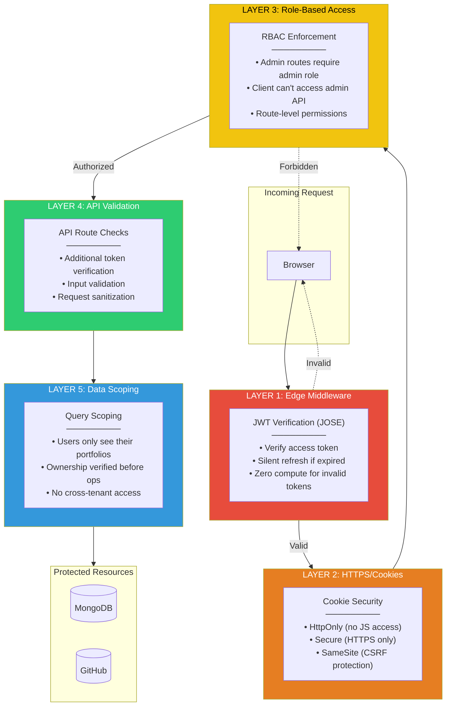

# Security Layers Diagram

## Defense in Depth Architecture

## Layer Details

### Layer 1: Edge Middleware (First Defense)

**Key Insight:** Invalid tokens are rejected at the CDN edge with zero server compute cost.

### Layer 2: Cookie Security

| Protection | HttpOnly | Secure | SameSite |
|------------|----------|--------|----------|
| XSS Token Theft | ✅ | - | - |
| Network Interception | - | ✅ | - |
| CSRF Attacks | - | - | ✅ |

### Layer 3: Role-Based Access Control

### Layer 4: API Route Validation

Example checks in each API route:
- Token presence verification
- Payload structure validation
- Input sanitization
- Type checking (TypeScript enforced)

### Layer 5: Data Scoping

**Key Insight:** Even if an attacker bypasses outer layers, queries are scoped to the user's own data.

## Attack Mitigation

| Attack Type | Mitigating Layer | How |
|-------------|-----------------|-----|
| Invalid Token | Layer 1 (Edge) | JOSE verification |
| Stolen Token | Layer 2 (Cookies) | HttpOnly prevents XSS |
| Privilege Escalation | Layer 3 (RBAC) | Role checks |
| SQL/NoSQL Injection | Layer 4 (API) | Input validation |
| Data Exfiltration | Layer 5 (Scoping) | Query scoping |

*Related: [Feature: Edge Authentication](../docs/04-key-features.md#feature-1-edge-fortress-authentication)*
