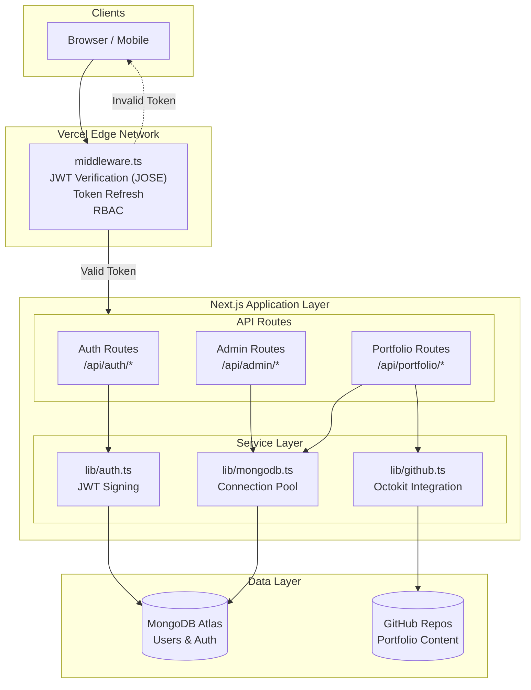

# System Architecture Diagram

## SourceShan Multi-Tier Architecture

## Component Description

| Layer | Component | Technology | Responsibility |
|-------|-----------|------------|----------------|
| **Edge** | Middleware | JOSE, Next.js Middleware | Auth verification, token refresh |
| **API** | Auth Routes | jsonwebtoken, bcrypt | Login, logout, token signing |
| **API** | Admin Routes | Mongoose | User CRUD, portfolio assignment |
| **API** | Portfolio Routes | Octokit | Content management, batch commits |
| **Services** | auth.ts | jsonwebtoken | Token creation and verification |
| **Services** | github.ts | Octokit | GitHub API interactions |
| **Services** | mongodb.ts | Mongoose | Connection pooling |
| **Data** | MongoDB | Atlas M0 | User credentials, portfolios |
| **Data** | GitHub | Repos | Portfolio JSON, images |

*Related: [Solution Architecture](../docs/03-solution-architecture.md)*
